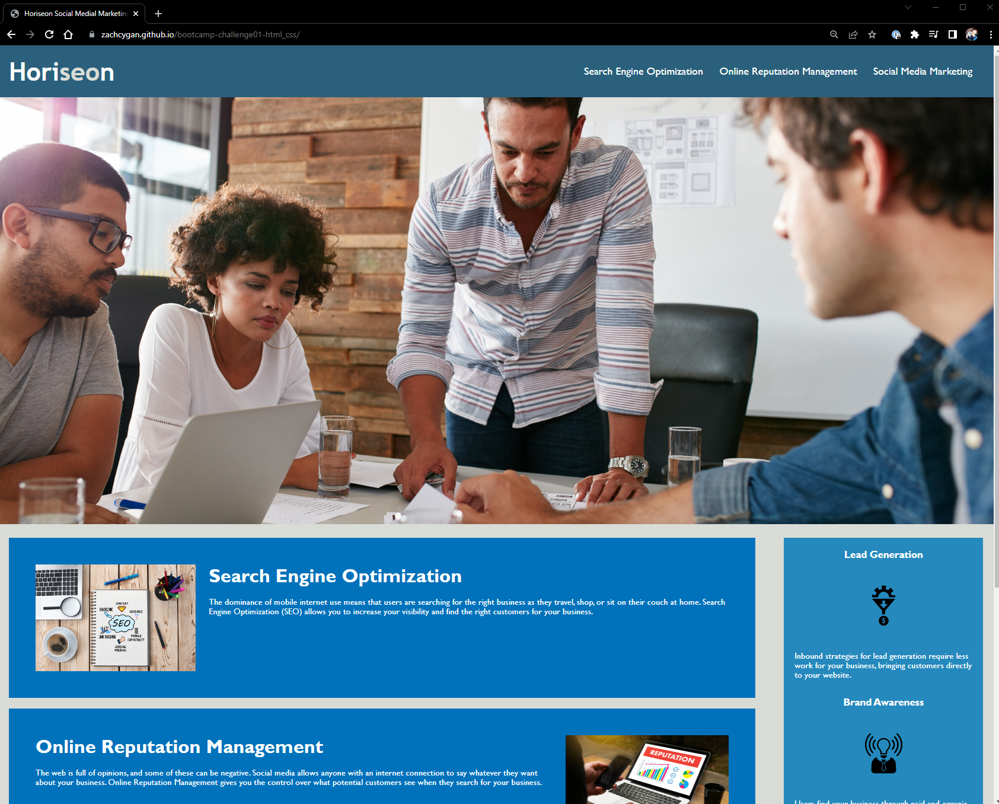
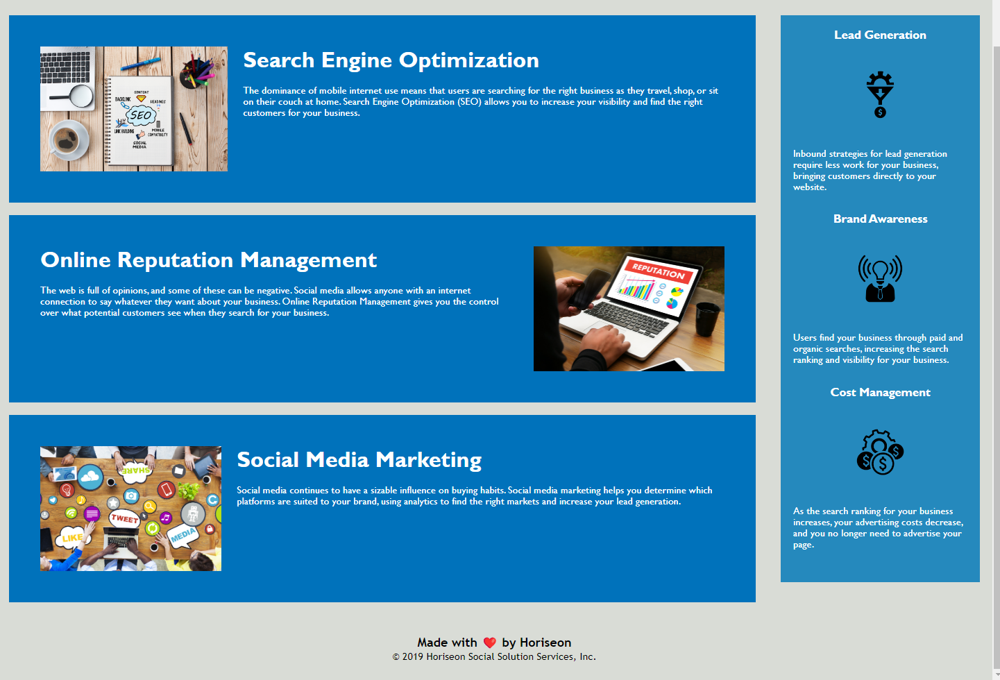

# <bootcamp-challenge01-html_css>

## Description

My motivation is to build good looking websites that are intuitive and effecient. I wish to easily communicate information from my code to the finished webpage. I built this project to have a better foundation on the basics of html and css. It has simple classes and follows and logical structure of a website. It contains numerous sections and elements that make up a simple webpage. I learned how to use simple styles in css and how to apply styles to multiple elements at the same time, thus making cleaner code. I also learned how to correctly use semantic elements to make the code follow a logical order. 

## Installation

The webpage is available at https://zachcygan.github.io/bootcamp-challenge01-html_css/. To view the source code within your browser, press F12 or right click the webpage and select "inspect" on windows. For MacOS,  press Command+Option+I or fn F12 (MacOS) to open Chrome DevTools. You can view any elements on the webpage or any of the styling by selecting the corresponding section in Chrome DevTools. 

Screenshots of the finished webpage are shown below:

    

